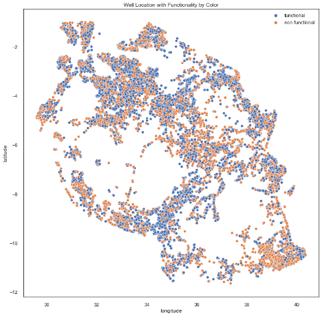

# World Wide Water - Predicting Well Functionality in Tanzania for UNICEF


World Wide Water analyzed thousands of water wells in Tanzania to find what attributes influence well failure the most. With our analysis, stakeholders like UNICEF, can gain better understanding about Tanzania's ongoing water crisis. 

## Organizational Objective
As it stands, much of the Tanzanian population lacks a basic access to consumable water. Many Tanzanian citizens collect water from groundwater sources or turn to private lenders to meet their needs. However, both options are risky and endanger consumers to illnesses like cholera and malaria. It is imperative for those who seek to improve water access in Tanzania to understand what factors are most influential in water well failure.

## Main Findings
We analyzed over fifty-four thousand water wells built between 1960-2013. We found three features that powerfully impact the functionality of water wells: 
1. Age of Well
2. Location of Well
3. Water Extraction Method

Our final model garnered a recall score of 78%, displaying a powerful ability to correctly categorize functional vs. non-functional wells.

## The Notebooks
The technical lead operated out of the mackoy branch, while technical associates assisted through pair programming. The main files for this project are in main_notebook.ipynb. 

## Data Cleaning
The dataset, tanzania_wells.csv, was is the primary data source. The dataset contained comprehensive information including but not limited to water quantity, latitude, longitude, donor information, population metrics, and extraction type. We featured engineered information for the age of the well. After a robust data cleaning effort and initial statistical analysis, the team modeled the data.

## Model Analysis
### EDA
### Well Age 


The first analysis concerns the relationship between the percentage of non-functional water wells and the age of the respective water well.
We found that older wells perform worse than wells that are younger. 

### Well Location 



The second analysis addresses the proportion of functional and non-functional water wells by location. Overall, there are several hotspots of non-functional wells. There are more non-functional wells in the southeast and central Tanzania. Ongoing political violence, terrorist activity, and border disputes are possible explanations for the concentration of non-functional wells in the southeast. Further, the cluster of non-functional wells in central Tanzania aligns with current social science theories about governmental efficacy. Fearon and Laitin (2003) show that areas with mountainous terrain are more difficult for governments to regulate. Thus, wells in this region may have less oversight. 

### Well Extraction Method 


The third analysis finds that wells that utilize "other" or "motor pumps" for extraction method fare comparatively worse than wells that use rope pumps.

# Decison Tree Model 
The simplest model, the decision tree model, had a recall score on the test data of 53%. In other words, this model was only able to correctly categroize non-functional wells a little over half the time. 

# Logistic Model 
The Logistic Model amassed a recall score of 59%. Meaning that the model correctly categorized 59% of non-functional wells. 

# Random Forest Model 
Our Random Forest model saw a great improvement with a recall score of 77%! 

# Reccomendations for UNICEF
We recommend that UNICEF pay close attention to older wells and allocate more resources to restoring older wells. While UNICEF cannot change the terrain in Tanzania, the organization can research efforts to construct more sustainable water source options that require less oversight than traditional wells. Finally, we recommended that UNICEF renovate wells that use motor pumps in favor of rope pumps. 

# Areas for Future Investigation
Analyzing the relationship between the rainy and dry seasons and the functionality of water wells in Tanzania could lend better insight into when water wells are prone to failure. Moreover, collecting data on how frequently communities utilize wells and the population size of that community could affect well functionality. Lastly, UNICEF may want to inspect the distance between water well locations and the communities they serve to enhance safe water access in Tanzania. 

# Further Inquiry 
Please review our full analysis in [our Jupyter Notebook](./main_notebook.ipynb) or our [presentation](./presentation.pdf). For any additional questions, please contact Sarah Jack | sajack2000@gmail.com, Mackoy Staloch | mackoy.staloch@gmail.com, Juana Tavera | tvrjuana@gmail.com 

# Repository Structure 
```
├── README.md                            <- The top-level README for reviewers of this project
├── main_notebook.ipynb                  <- Narrative documentation of analysis and modeling in Jupyter notebook
├── presentation.pdf                     <- PDF version of project presentation
├── data                                 <- Both sourced externally and generated from code
└── images                               <- Both sourced externally and generated from code
```
